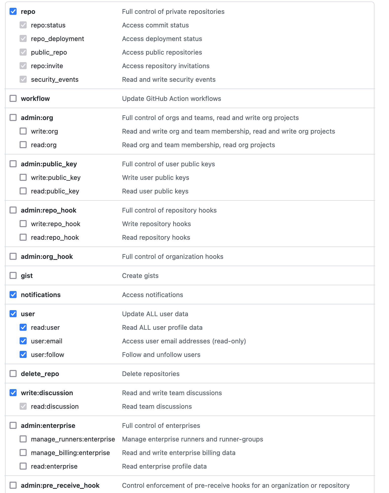
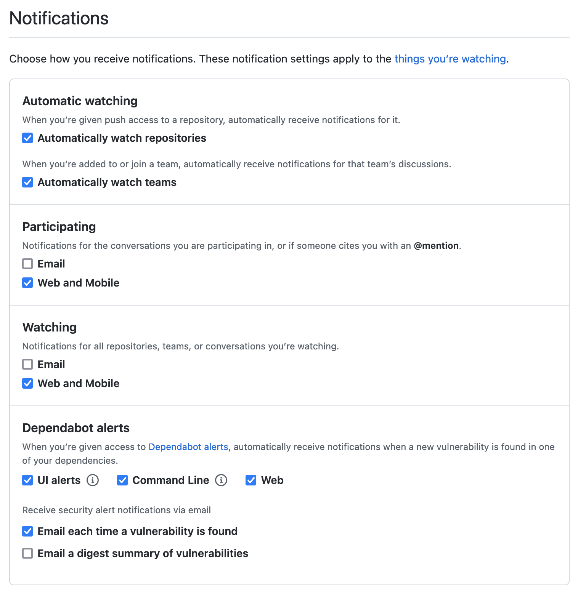
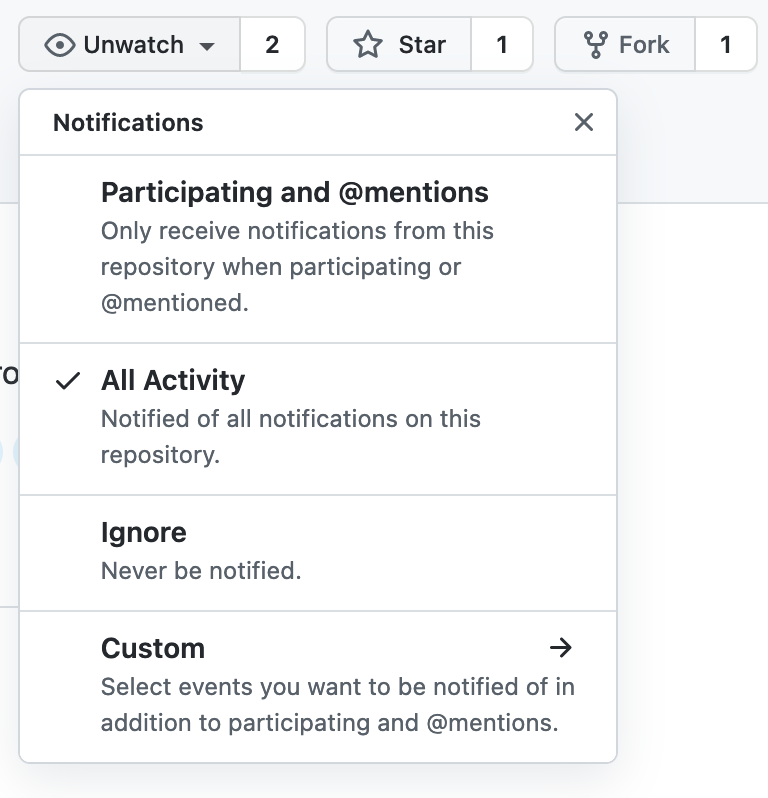

## Github Notifications app

This project uses Github API notifications in a React app. Carbon-components were used to build the frontend. 
The Electron app has built in MacOS notifications.

## get it up and running.

After you clone this project, do the following:

```bash
npm install

# start app as Electron desktop app (MacOS)
npm run electron-dev

# start app in your browser
npm run start
```
Access locally: http://localhost:5555

You will need a Github Personal Access Token (Profile - Settings - Developer settings) to use on the login page.


Login page:

URL: https://github.com
URL (enterprise): https://github.<company>.com

Token: Personal Access Token

To receive notifications please adjust your Github Profile notifications settings
(Profile - Notifications)


Add yourself as a watcher to repositories on Github in order to receive notifications from that repo
